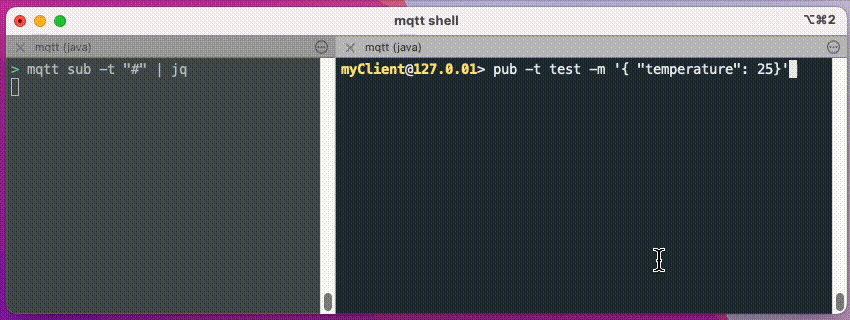

# Statefull-DataHub-Blog

This repo is accompanying the Statefull-DataHub-Blog by Kamiel Straatman

# What Datahub is

HiveMQ DataHub  is an integrated policy and data transformation engine that validates, enforces, and manipulates data in motion to ensure data integrity and quality across your MQTT deployment. The HiveMQ DataHub was introduced 2 years ago and has proven itself as a huge success. Datahub provides user-definable mechanisms to control how MQTT data and MQTT client behavior is handled by the HiveMQ broker at scale. The precense of HiveMQ DataHub  is a huge break with the traditional MQTT approach where brokers traditionally were fully data agnostic. The broker simply did NOT intervene with the data that is transported.

# Whats new.

Until recently Datahub was only able to process messages **stateless**, solely operating on a single message. But that has changed. As HiveMQ is moving more and more into the data value stream our datahub has evolved as well and now can also work in **stateful operation modes**. All with the same ease of defining, and configuring as you’re used to.

# Commands

This repo provides the nessesairy files to define schema's for data validation, scripting for data transforming and the policies to tie it all together. Just clone them in a working directory of your choise.

Please install and run a [HiveMQ broker](https://hwww.hivemq.com/download/) and add the following to your conf/config.xml file

```
<rest-api>
    <enabled>true</enabled>
    <listeners>
        <http>
            <port>8888</port>
            <bind-address>0.0.0.0</bind-address>
        </http>
    </listeners>
</rest-api>
```

Now enable the brokers DataHub functionality for testing ... :

`curl -X POST localhost:8888/api/v1/data-hub/management/start-trial`

... and upload all the nessesary assets by using the [HiveMQ CLI](https://github.com/hivemq/mqtt-cli).

```
mqtt hivemq schema create --id=temp_schema  --file temp_schema.json --type json
mqtt hivemq schema create --id=temp_avg_schema  --file temp_avg_schema.json --type json
mqtt hivemq script create -i moving_avg --file moving_avg.js --type TRANSFORMATION
mqtt hivemq data-policy create --file data-policy-Calculate-mov-avg.json
```

By entering the interactive mode of HiveMQ CLI using the `mqtt shell` command. Than connect and publish a (number of subsequent ) JSON messages containing a different temperature value `pub -t test -m '{ "temperature": 20}'`. Monitor the output by subscribing to your broker : `mqtt sub -t "#"`.

# See it working



As shown above the script will add the temperatures to a list containinging a maximum of 6 values and will calculate the average over these values. A moving average is a statistical method that calculates the average of a data set over a specified number of periods, continuously updating as new data is added ans smoothing out peaks in the incomming data.
